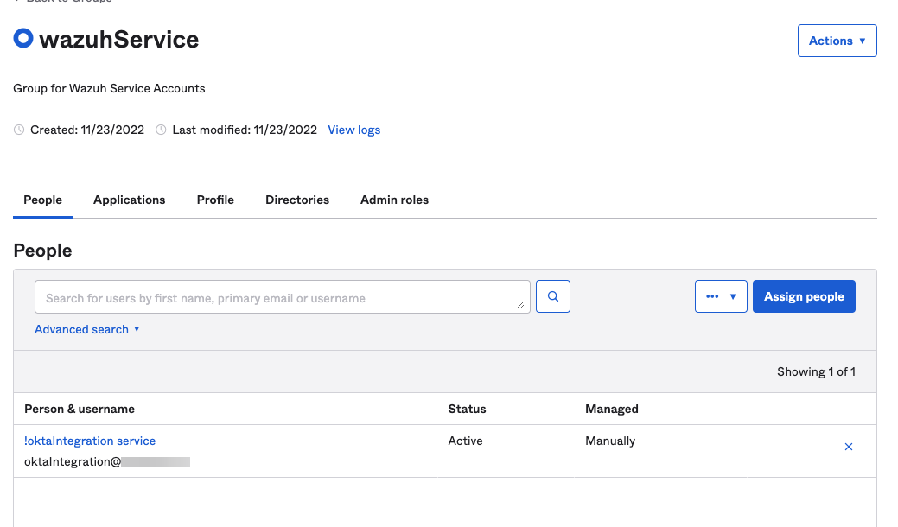
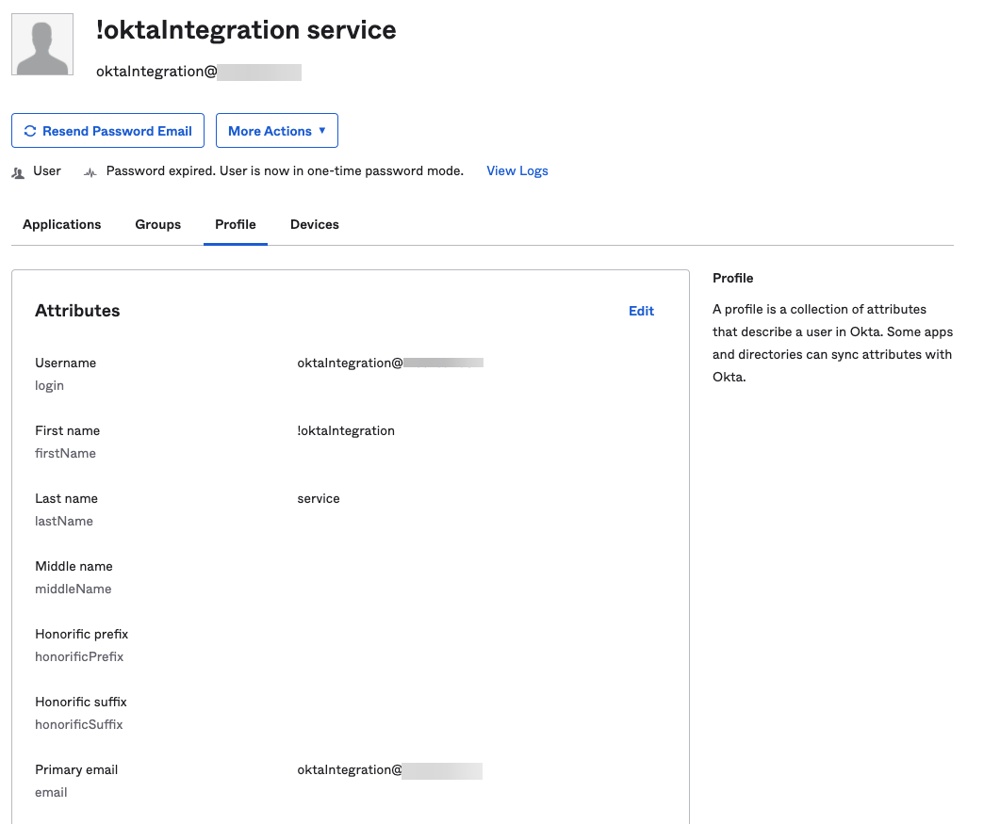
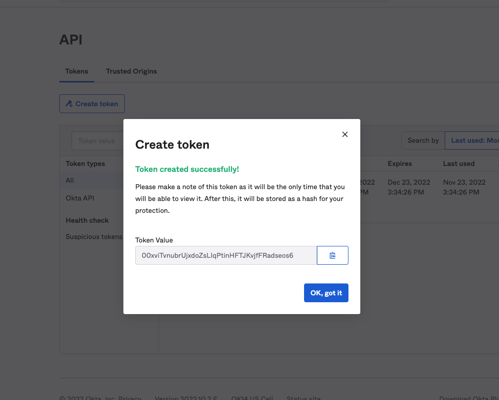

# README #


## Description ##

This application is used to pull in system logs from Okta to be analyzed, and correlated by Wazuh.

⚠️

This project is still in beta. MCC is Working to improved the overall reliability, security, and functionality of oktwah-py.

⚠️

## Instructions ##

### Setting up Oktwah ##

Clone the repository to the Wazuh server:

`git clone --depth 1 --branch v0.2.3 https://github.com/Manufacturing-Consulting-Concepts/oktwah-py.git`

Run the script:

`bash ./build.sh`

Enable and start the oktwah sevice:

```bash

systemctl enable oktwah
systemctl start oktwah

```

Verify that the service has successfully started:
`systemctl status oktwah`

## Configure Okta API Credentials ##

We do not recommend setting API credentials as a environmental variable at this point.  Instead, saving the key in the okta.conf file, and then ensuring that proper permissions are configured on the file.  

A read only Admin user should be created.  At the time of release `v0.0.1`, there is no way to create an unlisenced service account in Okta.  A fully lisenced user is required.  Create a group that will have read only admin access. 



Next create a new user and assign to the group created above.


Next, login as the new user.  You should be prompted to setup a new password, as well as enroll in in some MFA method.  Follow all onscreen prompts.  Once this is complete, login and go to: Admin > Security > API > Create Token.  Make notes of the token you will generate for yourself that is like this fictional example:



Once you have the oktwah clone to the wazuh server, paste the API token into the [okta.conf](app/okta.conf) file.  

The [build.sh](build.sh) file will move and configure the permission on this file.  

## Configuring Wazuh ##

The only change that should be need to get oktwah working is to tell wazuh where to find the logs files. This update can be made in either the ossec.conf or agent.conf file. Add in the following section

```xml

  <localfile>
    <log_format>json</log_format>
    <location>/var/ossec/logs/okta/okta.log</location>
  </localfile>

```

While Oktwah-py comes with basic Wazuh components to get alerts generated in Okta, MCC is working on expanding the rule base to better parse, and generate meaningful alerts in Wazuh.  We will continue to release rule updates throughout this beta.

## Logging in Oktwah ##

Oktwah performs appliction logging straight out of the box.  There are several logs that an administrator will want to be aware of.  

1. The Application Log
   1. Location: `/var/log/okta/okta.log`
   2. Contents: Application run time logging.

2. The Local Okta System Log
   1. Location: `/var/ossec/logs/okta/okta.log`
   2. Contents: JSON objects contain Okta system log entries. This is the local file that Wazuh will ingest. 

## Important Notes ##

Contrary to best practice, this alpha version does not enforce locked pip package version installations.  This is due to the fact that RHEL based distros do not have python3.8+ in their repos.  This prevents installation of the latest pip dependancies.  As such, the requirements.txt file will only install whatever the latest version is that is available.  

We will be fixing this in a future beta.  There are several options at our disposal that we are exploring.  

Options to make this work include installing the latest version of Python on the system.  MCC is not sure, however, if changing the python version could cause conflicts for other python applications running on the system.  For example the ones Wazuh runs, such as some of the Wodles.  MCC welcomes any insite that others in the community may have.  Ideally, we believe that this kind of application should be written in GO.  Currently we have a golang based PoC that can be found [here](https://github.com/Manufacturing-Consulting-Concepts/oktwah-go). Running this application as go would have many advantages.  Raw functionality is available with oktwah-go, we are just working out some kinks with parsing thay array of json objects that the okta API sends back.

## Application Owner & Contact ## 

| Name | Username |
|------|-------|
| David Hoenisch| @DavidHoenisch |

## TODO ##

- [ ] Build update feature that will pull in the latest release from github, update the oktwah application and restart the service.
- [ ] Harden systemd configuration
- [ ] Establish log file retention/rotation functionality
- [ ] Have Oktwah provide json formatted application logs
- [ ] Feature that uses the timestamp of the last log entry to determine where to start pulling logs from. This will prevent duplicate logs from being pulled in.